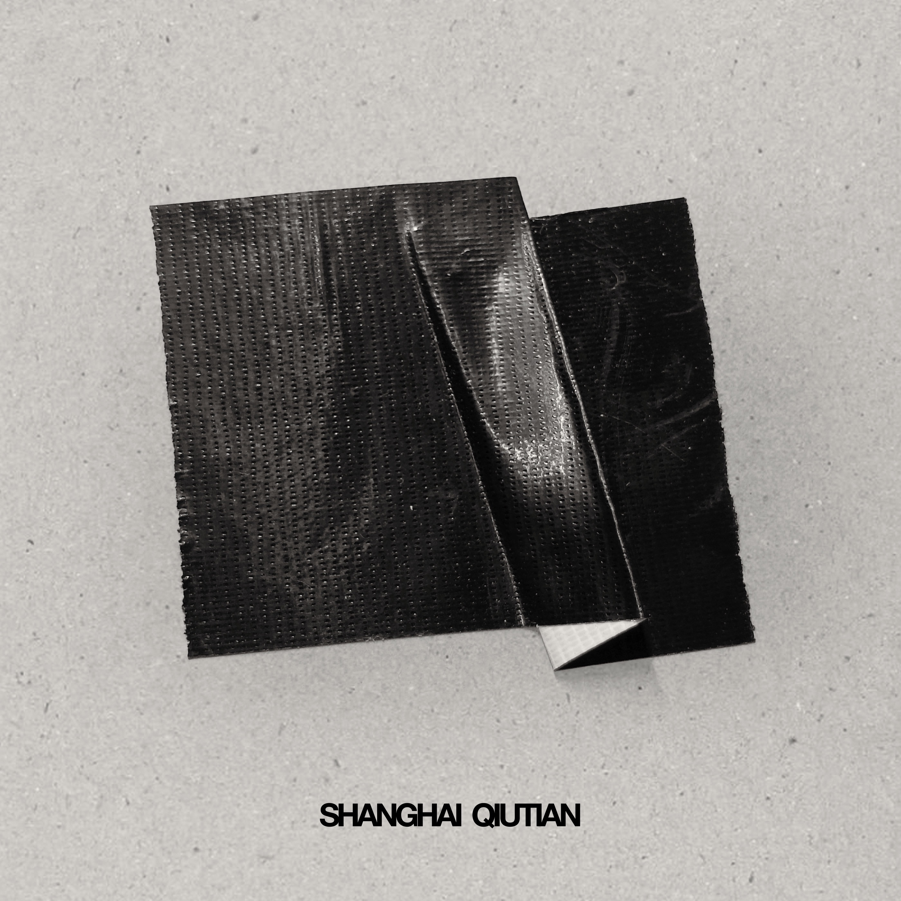
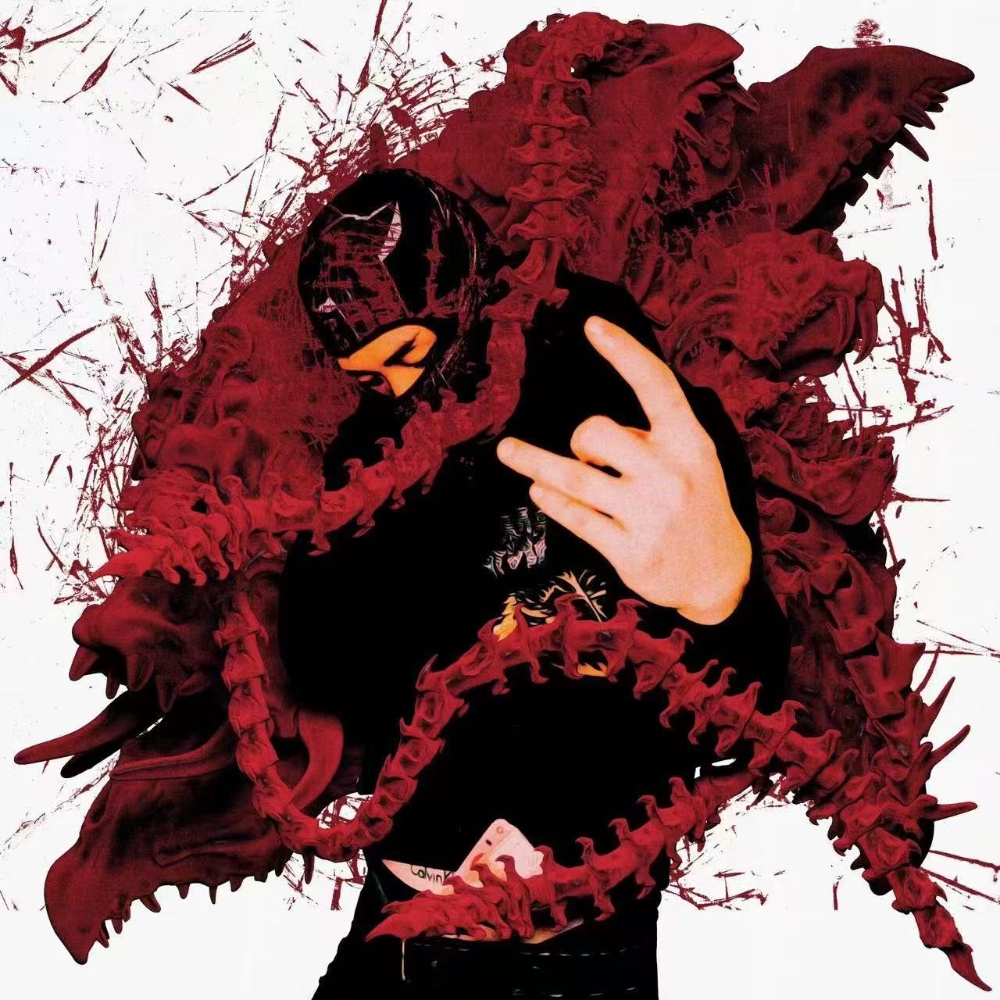
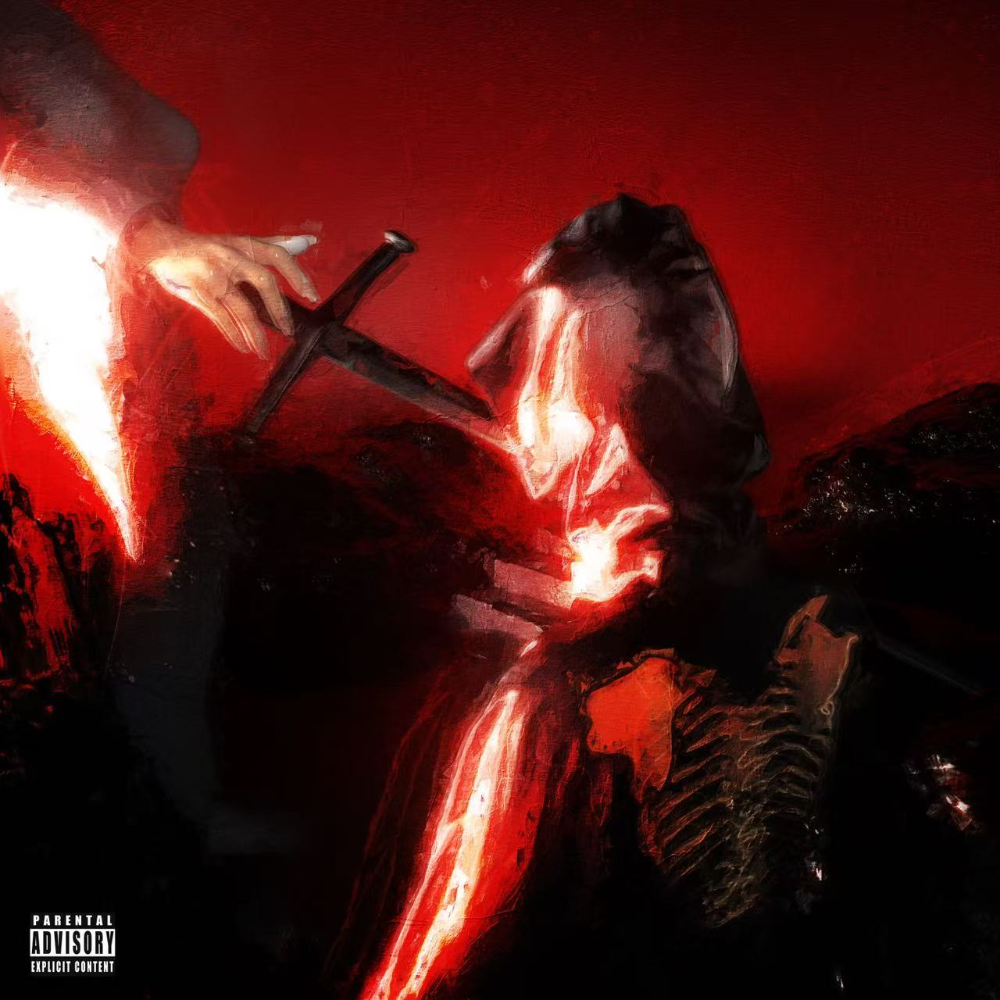

<!-- HEADER -->

  

---

## 👋 Hi, I’m Pete

- 🎓 CS在读，从事 **前端 & 全栈开发** 
- 💼 工作状态：实习 **前端开发工程师**
- ⚽️ 不写代码的时候可能在：看球 / 打游戏 / 听音乐 / 🍺 & 🥃

---

## 🧰 Tech Stack

  
  
  
  
  
  
  
  
  
  

---

## 📊 GitHub Stats

    
    

---

## 🧪 What I’m Playing With

- 🧬 人工智能 **大模型微调、推理加速、工具链搭建**
- 💻 前端方向 **矢量绘图、低代码、交互式工具**
- 📱 正在研究 **React Native客户端开发**

---

## 📫 Reach Me

  
  

## 🎵 Recent Listening

  
  
  
  
  
  

---

## 🍻 Small Thoughts

> 写代码是把脑子里的世界一点点搬出来。  
> 有时候是产品，有时候是实验，有时候就是一段“我现在正在这样生活着”的记录。

如果你看到这里，也许我们之后会在代码仓库、issue、PR 或球场边线哪儿再遇见 ⚽️
